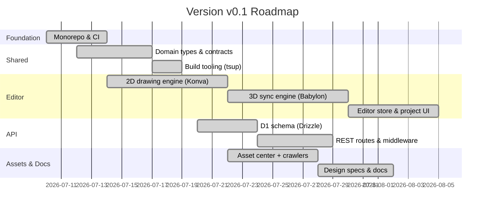

# Development Plan: Version v0.1

> **Iteration**: Foundation & Core Editor
> **Status**: Released — see [progress/v0.1.md](../progress/v0.1.md)
> **Period**: 2026-07 → 2026-08
> **Next**: [v0.2.x Plan](v0.2.x.md)

This document details the development plan for the **v0.1** iteration of the **MyFloorplan** ecosystem. v0.1 establishes the monorepo foundation, the shared type contracts, the core 2D/3D floorplan editor, and the API + asset pipeline scaffolding that every later version builds on.

## Objectives & Focus Areas

### 1. Monorepo Foundation
- pnpm workspaces with shared tooling (Vite, TypeScript, tsup).
- Consistent package layout: `web`, `api`, `mobile`, `admin`, `renderer`, `assetcenter`, `shared`.
- GitHub Actions CI for every deployable package.

### 2. Shared Core Types (`myfloorplan-shared`)
- Single source of truth for domain types split by domain: `architecture`, `interior`, `systems`, `environment`, `properties`.
- Aggregated `FloorplanData`, `Floor`, and `Project` documents shared by editor, renderer, and API.
- Asset catalog contracts: `Asset`, `AssetSource`, `AssetJob`, `FloorplanItem`, `FloorplanItemGroup`.
- Dual CJS/ESM builds with `.d.ts` declarations via tsup.

### 3. Core 2D/3D Editor (`myfloorplan-web`)
- 2D drawing engine on Konva: walls (`wallLines`), rooms, wall openings, placed items, grid snapping.
- 3D sync engine on Babylon.js: wall meshes with CSG openings, materials/textures, cinematic lighting.
- Zustand editor store: `wallLines`, `rooms`, `placedItems`, floors, render settings, selection, tools.
- Project management UI (list/create/edit/delete) wired to the API.
- Demo house loader and Firebase auth store (with a local dev bypass).

### 4. API Foundation (`myfloorplan-api`)
- Hono application on Cloudflare Workers (local development via Wrangler).
- D1 schema via Drizzle ORM: `users`, `projects`, `floorplans`, `assets`, `floorplan_items`, `floorplan_item_groups`, `asset_sources`, `asset_jobs`, `tags`.
- REST routes: users, projects, floorplans, assets, tags, asset-sources, asset-jobs, item-groups.
- Bearer-token auth middleware (production JWT verification deferred to v0.2).
- Health endpoint probing D1 and R2 bindings.

### 5. Asset Pipeline Foundation
- Asset center app (React + Three.js viewer) with crawler tools (sweethome3d, cadnav, archived3d, textures).
- Seed/populate scripts for the floorplan item library.

### 6. Documentation & Design Specs
- Guides: `ARCHITECTURE`, `HOWTO`, `INIT`, `PLAN`, `TODO`, `EDITOR_UX`.
- Design specs: REST API spec, floorplan data format spec, shared-package usage guide.

## Deliverables & Milestones

| Milestone | Deliverable | Package |
|---|---|---|
| M1 — Foundation | pnpm workspace + CI + READMEs | repo root |
| M2 — Shared types | Published type contracts + builds | `myfloorplan-shared` |
| M3 — Editor core | 2D/3D synchronized editor | `myfloorplan-web` |
| M4 — API core | D1 schema + REST routes + auth middleware | `myfloorplan-api` |
| M5 — Asset pipeline | Asset center app + crawler tools | `myfloorplan-assetcenter` |
| M6 — Docs | Versioned plan/progress + design specs | `docs/` |

## Out of Scope (deferred to v0.2)

- Production JWT verification (Firebase `jose`/JWKS) and real user auth flows.
- Asset upload endpoint (`POST /api/assets` currently returns `501`).
- Multi-floor editor UI (floor selector) and undo/redo history stack.
- Mobile (Capacitor) native platforms and touch controls.
- Headless renderer modularization and admin dashboard app shell.
