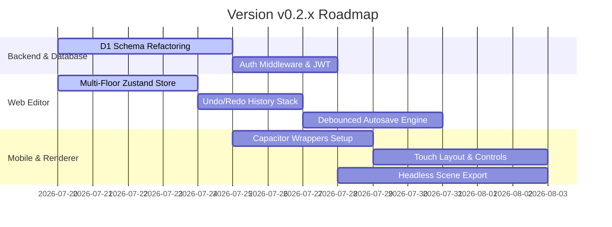

# Development Plan: Version v0.2.x

This document details the development plan and technical milestones for the **v0.2.x** iteration of the **MyFloorplan** ecosystem.

## Objectives & Focus Areas

The main goal of version `v0.2.x` is transitioning from a standalone 2D/3D editor prototype to a fully-networked, multi-floor, production-ready system with native mobile support and automated asset pipelines.

### 1. Persistence & Full API Sync
- **State Store Syncing**: Connect `useEditorStore` (Zustand) in `myfloorplan-web` directly to the `myfloorplan-api` backend.
- **Auto-Save Mechanism**: Implement a debounced sync engine that auto-saves local floorplan state changes to the Cloudflare D1 database.
- **Database Schema**: Refactor the database schema to natively support the `floors` structure, allowing users to save and retrieve multi-floor buildings.

### 2. Core Editor Upgrades
- **Multi-Floor Support**: Add a floor selector panel, handling independent `wallLines`, `rooms`, and `placedItems` arrays per level.
- **Undo/Redo History**: Add history stack management (past/future) inside Zustand.
- **Visual Improvements**: Add real-time measurement labels overlay in the 2D Konva canvas.
- **Camera Viewports**: Add a "First Person / Walkthrough" camera control scheme in the 3D Babylon view.

### 3. Mobile Platform (Capacitor Integration)
- **Capacitor Configuration**: Initialize Android and iOS platforms in `myfloorplan-mobile`.
- **Offline Mode caching**: Implement standard offline caching for project files in local indexedDB or SQLite via Capacitor storage.
- **Touch-Friendly Controls**: Adapt Konva 2D stage interaction handlers for standard gesture zooms and pan actions.

### 4. Shared Core & Admin Dashboard
- **Types Consolidation**: Build and export strict Typescript schemas from `@myfloorplan/shared`.
- **Scraper & Job Dashboard**: Scaffold `myfloorplan-admin` UI to monitor asset crawling logs, scraper configurations, and automated model optimization jobs.

---

## API Router Specification (v0.2.x)

All backend endpoints are prefixed with `/api` and require a valid auth token passed as `Authorization: Bearer <token>`.

| Route | Method | Description |
|---|---|---|
| `/users/sync` | `POST` | Synchronize Firebase Auth user info with D1 user metadata. |
| `/projects` | `GET` | Paginated list of projects belonging to the logged-in user. |
| `/projects` | `POST` | Create a new project workspace. |
| `/projects/:id` | `GET` | Retrieve metadata of a single project. |
| `/projects/:id` | `PUT` | Update project properties (name, description, etc.). |
| `/projects/:id` | `DELETE` | Remove project and all associated floorplan files. |
| `/projects/:id/floorplan` | `GET` | Load the full floor plan json (floors, layout data). |
| `/projects/:id/floorplan` | `PUT` | Save the updated floor plan data structure. |
| `/assets` | `GET` | Publicly query available 3D furniture models & textures. |
| `/assets` | `POST` | Register/upload a new 3D model asset to R2. |
| `/asset-sources` | `GET` / `POST` | Query or insert crawl sources (Sketchfab, archive3d, etc.). |
| `/asset-jobs` | `GET` / `POST` | Monitor automated optimization/importing pipelines. |

---

## Timeline & Milestones

